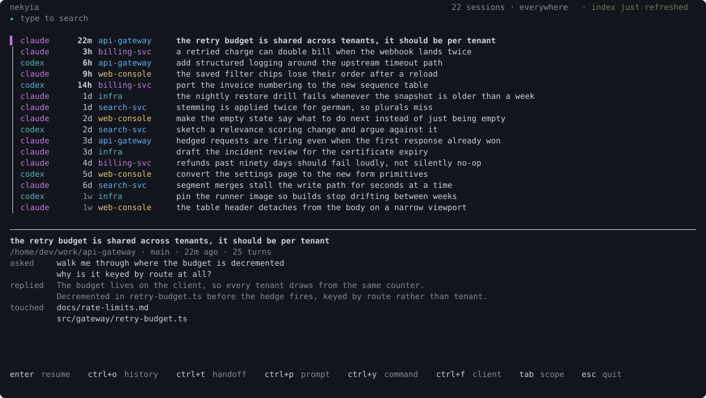
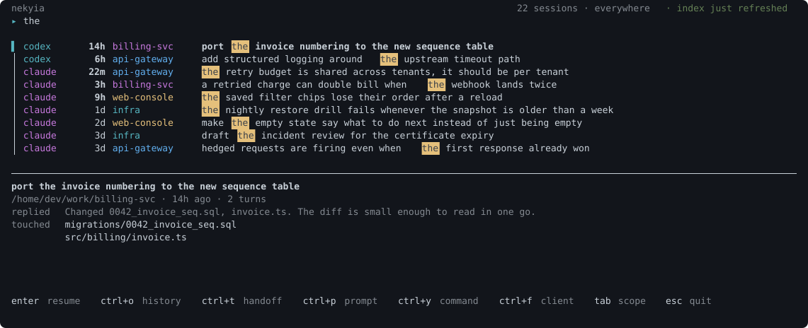
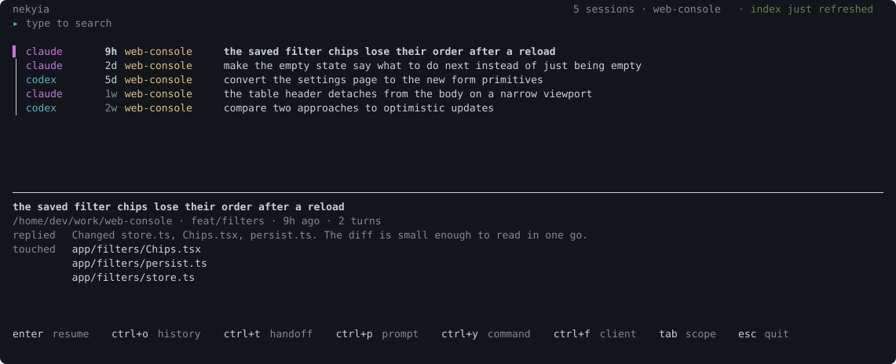
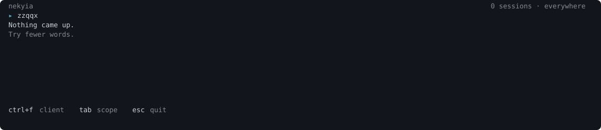
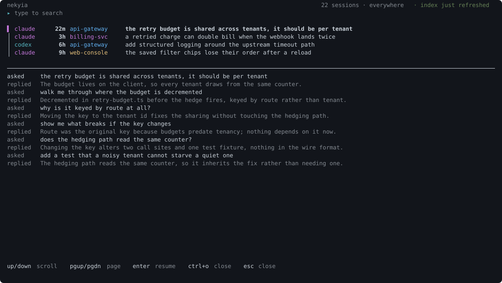
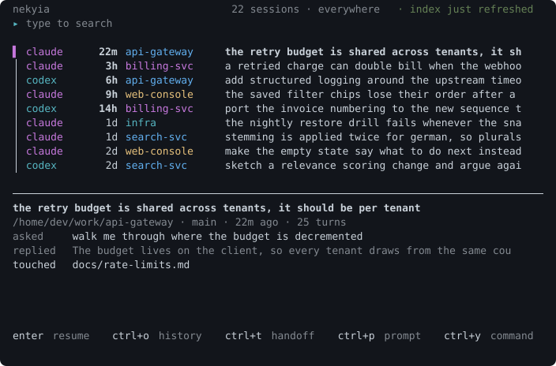

<div align="center">

# Nekyia

**Find the session. Pick up the thread.**

[](https://github.com/AraneaDev/Nekyia/releases)
[](https://github.com/AraneaDev/Nekyia/actions/workflows/ci.yml)
[](./LICENSE)
[](https://github.com/AraneaDev/Nekyia)
[](https://github.com/AraneaDev/Nekyia/commits/main)
[](https://www.conventionalcommits.org/)
[](#quick-start)

</div>



> **Nekyia** (Νέκυια) is the rite in the _Odyssey_ through which Odysseus calls up
> the dead and asks them what they know. This tool does something less dramatic
> with old agent sessions: it brings the useful context back when you need it.

Nekyia searches the local histories kept by your agent CLIs, ranks the sessions that
matter, and launches the right client. Verified clients resume the exact session.
Search-tier clients start fresh with a deterministic handover that says plainly it is
a brief, not a resumed state.

> **Status:** pre-release. Nekyia is **not yet published to npm**. Install from the
> source repository or from the package attached to the
> [GitHub pre-release](https://github.com/AraneaDev/Nekyia/releases). The command
> `bun install -g nekyia` is the planned published experience and does not work yet.

---

## Features

- **One Search Surface**: query Claude Code, Codex, opencode, Kilo Code, Codebuff, and Antigravity histories together
- **Verified Resume**: attach to the selected session by ID only where that exact command was tested
- **Deterministic Handovers**: start search-tier clients with every indexed user prompt, touched files, branch context, and bounded assistant prose
- **Two-Phase Indexing**: discover cheap fingerprints first, then hydrate only sessions that changed
- **Fast Local Search**: SQLite FTS5 combines weighted prompt relevance with recency decay
- **Interactive and Scriptable**: use the virtualized Ink picker or plain, JSON-capable CLI commands
- **Privacy Controls**: forget one session, prune deleted sources, or exclude whole directory globs
- **Extensible Manifests**: describe another client locally and use the conservative sniffer to scaffold a draft
- **Local by Design**: no network service, API key, telemetry, model-written summary, or tool-output indexing

## Installation

Nekyia requires [Bun](https://bun.sh/) 1.1 or newer.

### From a release

<!-- x-release-please-start-version -->
```bash
bun install -g github:AraneaDev/Nekyia#v0.0.4
```
<!-- x-release-please-end -->

Every published version is listed on the
[releases page](https://github.com/AraneaDev/Nekyia/releases).

### From source

```bash
git clone https://github.com/AraneaDev/Nekyia.git
cd Nekyia
bun install --frozen-lockfile
bun link
```

Both install paths expose `nekyia` and the shorter `nek` command.

## Quick start

### 1. Build the local index

```bash
nekyia index
```

The first run shows what Nekyia plans to inspect and asks for consent before it
opens a transcript store or creates the index. Use `nekyia index --yes` only when
you have already reviewed that boundary and need a non-interactive run.

### 2. Find a session

```bash
nekyia                         # interactive picker
nekyia search reconnect race   # table output
nekyia search reconnect --json # machine-readable output
nekyia last                    # newest session under this directory
```

Search defaults to the current directory. Pass `--all` to search everywhere,
`--client <id>` for one client, or `--file <path>` for sessions that touched a file.

In the picker, `tab` widens to every directory, and pressing it again narrows to the
project of the row under the cursor, so you can start anywhere and end up in one
project. The count beside the search line always names what is being searched.

Typing filters as you go, and the matching span is lit in every title, so the list
answers each keystroke rather than only shortening.



Narrowing to one project names it, so you always know what is being searched:



A query that matches nothing says what to try rather than leaving an empty screen:



### 3. Read the history before you commit to it

`ctrl+o` opens the session under the cursor and gives it the screen: what you asked,
what came back, and which files moved. Arrow keys scroll a line, the page keys scroll
a screen, and `esc` closes it again.



### 4. Resume or hand over

Press Enter in the picker, or run `nekyia last`. A resume-tier row launches the
verified exact-session command. A search-tier row asks for confirmation, builds a
deterministic handover, and starts a new client session with that context.

## Keys in the picker

| Key | What it does |
| --- | --- |
| type | Filter as you go; the match is lit in each title |
| `up` / `down` | Move the cursor, or scroll the history while it is open |
| `enter` | Resume the session, or start a briefed one for a search-tier client |
| `ctrl+o` | Open the session's history, and close it again |
| `tab` | Widen to everywhere, or narrow to the project under the cursor |
| `ctrl+f` | Cycle the client filter |
| `ctrl+p` / `ctrl+y` | Copy the opening prompt, or the command that would run |
| `esc` | Close the history if it is open, otherwise quit |

The picker lays itself out against the terminal it is drawn in, so a narrow window
gets the same interface rather than a broken one:



## Commands

| Command | What it does |
| --- | --- |
| `nekyia` | Open the interactive picker |
| `nekyia search <query>` | Search from the terminal, with optional JSON output |
| `nekyia last` | Launch the newest visible session in this directory |
| `nekyia index [--rebuild]` | Refresh fingerprints and changed session content |
| `nekyia show <uid>` | Print a deterministic handover as Markdown |
| `nekyia doctor [--sniff]` | Report clients, paths, parse failures, caps, and unsupported stores |
| `nekyia forget <uid>` | Remove one session and every searchable facet from the index |
| `nekyia prune --missing` | Remove indexed sessions whose sources disappeared |
| `nekyia exclude <glob>` | Add an index-time directory exclusion |

Run `nekyia --help` for search filters, sort modes, limits, and command-specific options.

## Picker keys

| Key | Action |
| --- | --- |
| Type | Search indexed session text |
| Up / Down | Move through results |
| Enter | Resume, or confirm a fresh briefed session |
| Tab | Toggle this directory / everywhere |
| Ctrl+F | Cycle the client filter |
| Ctrl+P | Copy the first indexed prompt |
| Ctrl+Y | Copy the verified resume command when one exists |
| Escape | Cancel confirmation or quit |

## Supported clients

Support means the store format was exercised against real or fidelity-matched local
data, not guessed from a likely path. Resume means the selected ID can be passed to a
verified resume command. Search means Nekyia starts a fresh briefed session because
exact attachment was not confirmed.

| Client | Tier | Command Nekyia runs |
| --- | --- | --- |
| Claude Code | Resume | `claude --resume <id>` |
| Codex | Resume | `codex resume <id>` |
| Antigravity CLI, agy | Resume | `agy --conversation <id>` |
| opencode | Search | `opencode <brief>` |
| Kilo Code | Search | `kilo <brief>` |
| Codebuff / freebuff | Search | `codebuff --cwd <cwd> <brief>` |

Kilo shares opencode's tested store format, but its executable was not installed during
command verification. opencode and Codebuff were exercised against real local IDs, but
the result did not prove attachment to the requested context. I do not call any of those
three resumable. Search-tier clients always start fresh briefed sessions. They never claim
to recover tool state or file snapshots, and sending a handover can cost tokens.

## How it works

Nekyia separates indexing into two phases. Discovery reads bounded metadata and stable
fingerprints. Hydration runs only for new or changed sessions, streams or projects the
relevant content, and commits metadata plus search facets atomically to SQLite.

Search weights titles, user prompts, and selected assistant prose differently, then can
blend relevance with recency. Fork chains collapse to one visible result. Tool output is
excluded because command results and file dumps are noisy, large, and likely to contain
private material that does not belong in search.

The index normally lives at `~/.local/share/nekyia/index.db`; configuration lives at
`~/.config/nekyia/config.json`. Nekyia honours `XDG_DATA_HOME` and `XDG_CONFIG_HOME`.

## Privacy and data retention

Nekyia makes no network requests. There is no network service, no API key, and no telemetry.
The handover is deterministic and makes no model call.

The index reads transcripts already on your disk and stores selected paths and text
locally. That indexed copy can survive deletion of the original transcript. You control
that retention explicitly:

- `nekyia forget <uid>` purges one indexed session
- `nekyia prune --missing` purges sessions whose source files disappeared
- `nekyia exclude '/work/private/**'` adds an exclusion, followed by `nekyia index --rebuild` to remove existing matches

Nekyia does not promise secret redaction or index encryption. Review `show`, `doctor`,
and JSON output before pasting it into a public issue.

## Adding a client

User manifests live in `~/.config/nekyia/clients/*.json`. Schema version 1 describes the
client roots, storage format, support tier, and optional launch templates. A minimal flat
JSONL manifest looks like this:

```json
{
  "schema": 1,
  "id": "my-client",
  "name": "My client",
  "roots": ["~/.local/share/my-client"],
  "format": "jsonl-transcript",
  "tier": "search",
  "jsonl": {
    "glob": "sessions/*.jsonl",
    "variant": "generic",
    "generic": {
      "idFrom": "filename",
      "cwdPath": "cwd",
      "tsPath": "timestamp",
      "rolePath": "role",
      "textPath": "text",
      "userRoles": ["user"],
      "assistantRoles": ["assistant"]
    }
  },
  "brief": {
    "cmd": "my-client",
    "args": ["{prompt}"],
    "cwd": "{cwd}"
  }
}
```

`nekyia doctor --sniff` looks for session-shaped stores without declaring them supported.
`nekyia doctor --sniff --emit-manifest ./my-client.json` writes a non-overwriting draft
for the first store it can describe. Inspect and test that draft before moving it into the
user manifest directory or contributing it.

## Development

```bash
bun install --frozen-lockfile
bun run typecheck
bun run test
bun pm pack --dry-run
```

CI runs the frozen install, typecheck, full suite, and package check on Linux and macOS.
Releases use Conventional Commits and Release Please.

## Roadmap

These clients still need hands-on testing before I ship a built-in manifest: Aider,
Goose, Crush, Cursor CLI, GitHub Copilot CLI, Qwen Code, Continue CLI, Droid,
Amazon Q Developer CLI, Plandex, OpenHands, Amp, Warp Agent, Grok CLI, Rovo Dev,
Auggie, Trae, Cline CLI, and Zed.

I also plan compiled standalone binaries through `bun build --compile` for Linux and
macOS on x64 and arm64. They are not part of this pre-release, so Bun is required.

## License

Nekyia is available under the [MIT license](LICENSE).

---

Built by [Aranea Development](https://aranea-development.nl). In the _Odyssey_, Odysseus
digs the trench and the dead crowd forward; he holds them back until the one shade he
needs may speak. `nekyia --version` says the same thing in one line.
